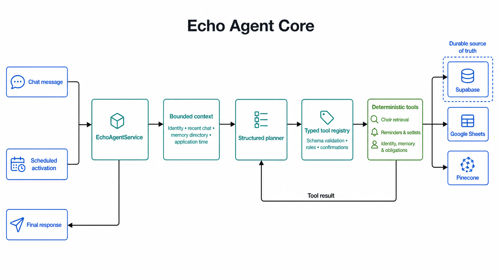

# Echo Choir Assistant

Echo is a persistent, tool-using choir operations agent. It combines structured
LLM planning with deterministic permissions, dates, workflows, scheduling and
database-backed state.

Echo currently ships with a WhatsApp transport powered by Baileys and a local
browser staging group that runs the same application without starting WhatsApp.



## Quick Start: Browser Staging

The staging group is the fastest way to explore Echo. It uses the real agent,
tools, memory, workflows and scheduler while replacing WhatsApp with a local
chat interface.

### Requirements

- Node.js 20 or newer
- A Supabase project for staging
- A Pinecone index
- A Google Cloud service account with read access to a Google Sheet
- OpenRouter and Cohere API keys for the checked-in model configuration

### 1. Install Dependencies

```powershell
npm ci
```

### 2. Create Echo's Supabase Tables

Open the SQL editor in your staging Supabase project. Run every file in
`supabase/migrations` in filename order, beginning with
`202608110001_echo_agent_v3.sql`.

These files create Echo's identities, member memory, conversations, workflows,
scheduled tasks, operational state and Baileys authentication storage. Use the
Supabase service-role key in the server environment; the tables intentionally
do not expose public client policies.

### 3. Prepare Pinecone And Google Sheets

Create a Pinecone index whose dimension matches `embeddings.dimension` in
`config/models.yaml`. The checked-in configuration currently uses 1024
dimensions.

Create or select the Google Sheet Echo will read. Share it with the email
address from your Google service-account JSON file. Choir retrieval and
scheduled-message tests need sheet data; the application cannot invent missing
rota, attendance or setlist assignments.

The fictional staging seed includes `Maya Reed` as a useful sample song leader.
Using that canonical name in sample rota data allows leader-resolution and
setlist scenarios to be exercised immediately.

### 4. Configure Staging

Create the private staging environment file from the committed template:

```powershell
Copy-Item .env.staging.example .env.staging
```

Fill in the placeholders in `.env.staging`. Keep the completed file private.
The service-account JSON path in the template points to an ignored `secrets`
location; adjust it if your credential is stored elsewhere.

### 5. Load Fictional Staging Members

```powershell
npm run seed:identities:staging
```

This loads the committed `seeds/identities.staging.json` file into the staging
Supabase project. It provides a fictional creator, superuser and ordinary
members with synthetic identifiers, display names and aliases. The seed is
idempotent and is never intended for WhatsApp delivery.

### 6. Start Staging

```powershell
npm run staging
```

Open [http://127.0.0.1:3100](http://127.0.0.1:3100). Select a member under
**Speaking as**, send messages, reply to Echo, inspect agent activity and use
the Operations view to test schedules and application time travel.

The browser staging command does not start Baileys.

## What Echo Can Do

- Answer choir rota, attendance, event, resource and song-library questions
- Reason across multiple retrieved sources with bounded context
- Understand quoted messages and preserve durable conversation history
- Learn bounded member facts, display names and aliases
- Create, edit, confirm, cancel and recover personal reminders
- Accept and update combined or separate worship and praise setlists
- Validate setlist leaders using verified backend identities
- Plan setlist nudges and later setlist broadcasts
- Generate Sunday and Wednesday rota reminders from current evidence
- Run persistent recurring agent tasks against fresh spreadsheet data
- Mention resolved members without exposing private identifiers to the model
- Recover reminders, workflows, obligations and scheduled tasks after restart
- Enforce member, superuser and creator permissions deterministically

See the [feature manual](documentation/feature-manual.md) for user-facing
commands and behavior.

## Architecture

Echo follows a hybrid architecture:

1. The scheduler activates the application at the required time.
2. The persistent agent loads bounded relevant context and decides what action
   is appropriate.
3. Tools provide controlled access to choir data, memory, identity, workflows
   and messaging.
4. Deterministic services validate permissions, dates, ownership and state
   transitions.
5. Supabase remains the source of truth for persistent operational state.

The main framework boundaries are:

- `src/framework`: transport-neutral contracts, plugins, prompts and deployment profiles
- `src/agent`: planner/executor runtime, tools, memory and persistence ports
- `src/domains/choir`: choir intelligence and operational services
- `src/deployments/echo`: Echo's concrete deployment composition
- `src/integrations`: Supabase, Google Sheets, Pinecone, models, scheduler and transports
- `src/workflows`: deterministic reminder and setlist workflows
- `src/prompts`: canon, runtime, choir-domain and Echo prompt packs

New transports and domains can be added through adapters, plugins and deployment
profiles without replacing the core executor.

Read the full [architecture documentation](documentation/echo-3-architecture.md)
and [framework extension guide](documentation/extending-echo.md).

## Configuration

### Agent Runtime

`config/agent.yaml` is the single source of truth for agent execution limits,
context and memory budgets, planner bounds, tool-result retention, reusable
procedures and retrieval evidence limits.

### Models

`config/models.yaml` assigns configured providers and models to planner, fast
response and extraction roles. Provider credentials remain in environment
files and are referenced by variable name; API keys must never be written into
YAML.

`config/models.groq.yaml` is an alternative provider configuration.

### Environment

- `.env.staging.example` documents browser-staging variables.
- `.env.staging` contains private staging credentials and is ignored by Git.
- `.env` contains private production credentials and is ignored by Git.
- `seeds/identities.example.json` is the production identity template.
- `seeds/identities.private.json` is the ignored production seed.
- `seeds/identities.staging.json` contains safe fictional staging identities.

## Tests

```powershell
npm run typecheck
npm test
npm run build
```

The automated suites cover framework contracts, model routing, retrieval,
memory, conversation-history search, reminders, setlists, recurring tasks,
scheduler recovery, permissions and local staging. They do not start Baileys.

## Production WhatsApp Deployment

1. Create a private `.env` with production credentials.
2. Apply the SQL files in `supabase/migrations` to the production Supabase
   project.
3. Copy `seeds/identities.example.json` to
   `seeds/identities.private.json` and add verified privileged identities.
4. Run `npm run seed:identities`.
5. Set `ECHO_ENVIRONMENT=production` and the production
   `WHATSAPP_GROUP_ID`.
6. Run the verification commands above.
7. Start Echo with `npm start`.

Production refuses to start without database-backed creator and superuser
identities with verified WhatsApp identifiers. Baileys authentication is stored
in Supabase so sessions survive server restarts.

See the [deployment guide](documentation/echo-3-deployment.md) for recovery,
health endpoints and hosting details.

## Privacy And Security

- Never commit `.env`, `.env.staging`, service-account JSON, private seeds or
  Baileys credentials.
- Use Supabase service-role credentials only on the server.
- Keep production and staging Supabase projects separate.
- Display names and aliases never grant permissions; verified transport
  identifiers are authoritative.
- Private identifiers are resolved server-side and are not passed to the model
  as member mentions.
- Review model-provider data policies before using real choir conversations.

## Documentation

- [Feature manual](documentation/feature-manual.md)
- [Architecture](documentation/echo-3-architecture.md)
- [Local staging group](documentation/local-staging-group.md)
- [Deployment](documentation/echo-3-deployment.md)
- [Important scheduled times](documentation/important-times.md)
- [Extending Echo](documentation/extending-echo.md)
