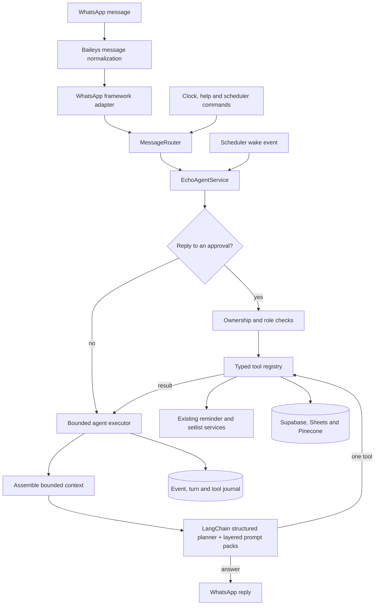

# Echo 3 Agent Architecture

Echo 3 is the default choir deployment of a reusable persistent-agent framework. Baileys remains its current WhatsApp transport, Supabase is its durable source of truth, and the existing reminder and setlist workflows remain deterministic tools.

## Main Flow

## Core Principles

- **The model proposes; code enforces.** Tool schemas, permissions, confirmations and workflow state transitions are deterministic.
- **The scheduler activates Echo; it does not authorize a message.** Echo checks current schedule evidence and obligation state before sending, skipping or deferring.
- **Supabase is durable memory.** Runtime maps are bounded lookup optimizations only.
- **Agent turns are bounded.** The checked-in `config/agent.yaml` allows at most 10 steps, two non-recoverable tool failures and five minutes per turn. The structured planner supplies a short revisable plan, executes a tool, observes its result and plans the next step. These limits are configuration, not hard-coded runtime constants.
- **Events are idempotent.** WhatsApp message IDs and scheduler occurrence keys prevent duplicate processing after retries.
- **Context is bounded.** Each transport turn starts with up to five recent messages, identity, a compact member profile only when relevant and a metadata-only memory directory. Facts, block values, older history and obligations are loaded only through bounded tools. Scheduled activations do not load chat history by default.
- **Tools are capability-scoped.** The planner receives only relevant capability groups and can explicitly activate another group when needed.
- **The runtime is transport-neutral.** WhatsApp-specific message shapes are converted at the application edge.
- **Deployments are composable.** A profile selects typed plugins, prompt packs, model names and a transport adapter.

## Framework Boundaries

- `src/framework/contracts`: neutral incoming and outgoing messages.
- `src/framework/ports`: model, transport and scheduler interfaces.
- `src/framework/plugins`: typed static plugin registration and dependency ordering.
- `src/framework/prompts`: ordered prompt-pack composition.
- `src/framework/deployments`: deployment profile validation.
- `src/deployments/echo`: current Echo-specific assembly.
- `src/prompts`: reusable canon/runtime packs and choir/Echo-specific packs.

The framework does not dynamically download or execute plugins. Contributors add typechecked plugins to a deployment factory.

## Persistent State

- `echo_members`: member records. Automatically discovered members may have no canonical schedule name yet.
- `echo_member_identifiers`: verified phones, WhatsApp JIDs, aliases and push names.
- `echo_member_roles`: member, superuser and creator permissions.
- `echo_memory_blocks`: small Letta-style agent, chat, member and week memory blocks.
- `echo_member_memory_facts`: bounded conversational facts, limited to 20 per member.
- `echo_agent_obligations`: ongoing responsibilities and their due times.
- `echo_scheduled_agent_tasks`: owned recurring objectives, deterministic schedules, next runs and bounded procedure hints.
- `echo_weekly_interpretations`: semantic schedule assessments keyed by week and source hash.
- `echo_conversation_messages`: persistent group transcript, including quote references.
- `echo_agent_events`, `echo_agent_turns`, `echo_tool_executions`: execution journal and diagnostics.
- `echo_agent_approvals`: durable confirmations for protected agent-tool changes, tied to Echo message IDs and the requesting member.
- `echo_sync_state`: synchronization freshness, locking and source state.
- `echo_audit_log`: identity and profile administration audit records.
- `wa_auth_creds`, `wa_auth_keys`: Baileys authentication state, isolated by session ID.

Private identifiers are stored in Supabase. They are not included in prompts or returned by identity tools.

## Identity And Access

1. A transport adapter supplies authoritative sender identifiers, and Echo resolves phones or JIDs against verified database identities.
2. By default, `WHATSAPP_GROUP_ID` is the production membership boundary. An unresolved participant there can be onboarded with only the ordinary `member` role. Enabling `WHATSAPP_ALLOW_ALL_GROUPS` deliberately broadens that accepted group boundary.
3. WhatsApp push names are conversation evidence, never identity or authorization credentials.
4. Onboarding initializes a permanent `member_profile` memory block, then the executor reloads context before continuing the original request.
5. Names from schedules are resolved to canonical members before mentions are built.
6. Creator-only identifier and canonical-name changes require confirmation and are audited.
7. The database member directory refreshes after identity or profile changes.

## Memory

- Stable persona and operating policy are read-only agent memory blocks.
- Each member has a permanent profile block containing their preferred display name, observed transport names and bounded aliases. The planner can reconcile a reliable WhatsApp name discrepancy through a self-scoped tool.
- Recent messages preserve group conversation and quoted-message context.
- Complete conversation history remains in Supabase and can be searched through bounded extracts without loading the whole transcript.
- Member facts are stored only when directly supported by the conversation.
- Fact categories are restricted to preferences, availability, communication and choir context.
- Member facts do not expire on a timer. Importance, verification, reinforcement and recency decide which fact is replaced when the per-member limit is full. The permanent profile is outside this replacement pool.
- Large or current choir data remains behind retrieval tools instead of being copied into prompts.
- Completed tool steps remain available to the current turn as bounded summaries. Oversized results are compacted before the next planning decision, while full executions remain journalled.

## Schedule Understanding

Echo retrieves the relevant available evidence for a target week and asks the primary model to interpret what it means operationally. This allows descriptions such as a special service, cancellation, another group ministering or no rehearsal to affect the decision without maintaining a hard-coded event-name list.

Retrieval uses structured semantic source selection rather than exclusive keyword-to-sheet routing. A request can combine several source categories, while deterministic temporal parsing maps those categories to concrete monthly data. Results include provenance and missing-source information so the bounded planner can refine an incomplete search before answering.

The interpretation is cached with the retrieved source hash. When the source changes, the previous interpretation no longer matches and Echo evaluates the week again.

## Synchronization

- The synchronization tool first checks `echo_sync_state`.
- Recovery synchronization is considered fresh for 24 hours.
- Echo retrieves first and only considers synchronization when the returned evidence is empty, materially sparse, or contains unusable blank rows.
- After synchronization, Echo retries the original retrieval at most once.
- `sync_if_stale` is hidden from the normal planner catalogue until retrieval reports insufficient evidence.
- A database lock prevents concurrent application instances from syncing at once.
- The existing sync engine reports a source hash and changed row counts.
- A forced sync is restricted to a superuser or creator.

## Model Routing

- Echo has one agent runtime, not a collection of subagents. Model roles are limited to primary planning, fast read/conversation work and narrow temporal-phrase normalization.
- A central registry resolves each role to the provider and model declared in `config/models.yaml`. The active deployment uses separate planner, fast-response and temporal-extraction roles; these are workload roles, not subagents.
- Provider adapters construct LangChain models for configured chat providers and Cohere embeddings. Domain services depend only on the role resolver.
- When a retryable model request fails, only that request is attempted on the next configured endpoint. Tools, database writes and outbound messages are never replayed by model failover.
- Failed endpoints enter a bounded increasing cooldown configured in `config/models.yaml`. Invalid requests and malformed prompts are returned immediately instead of being repeated against every provider.
- Embeddings have separate provider, model and dimension configuration because changing an embedding model requires rebuilding the vector index.

## Integrated Systems

- Baileys connection, message normalization and sending.
- Deterministic reminder and setlist workflow services.
- Centralized application clock and job scheduler.
- Google Sheets synchronization and direct sheet reads.
- Pinecone retrieval.
- Reminder and setlist Supabase tables integrated behind choir workflow tools.

The Echo deployment factory injects these services through typed ports without duplicating their domain logic.

## Test Boundary

The self-test suites use in-memory adapters and a local group-chat simulator. Together they exercise conversation, history search, quotes, mentions, permissions, durable approvals, reminders, setlists, recurring tasks, semantic schedule decisions, scheduler delivery and recovery, duplicate events, loop limits and bounded memory without connecting to Baileys. The browser staging environment is the end-to-end boundary for real Supabase, Sheets, Pinecone and configured model calls.
